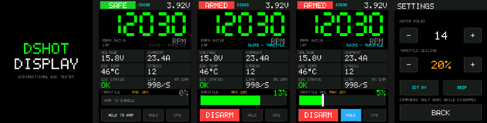
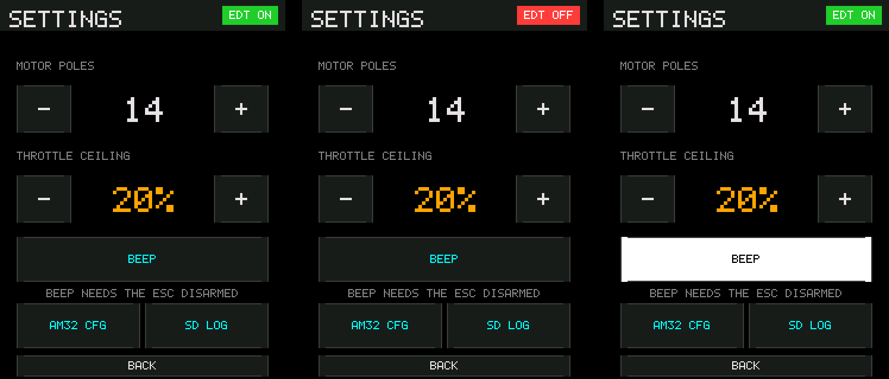
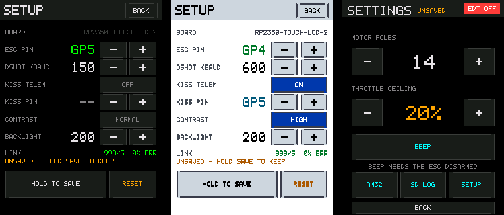
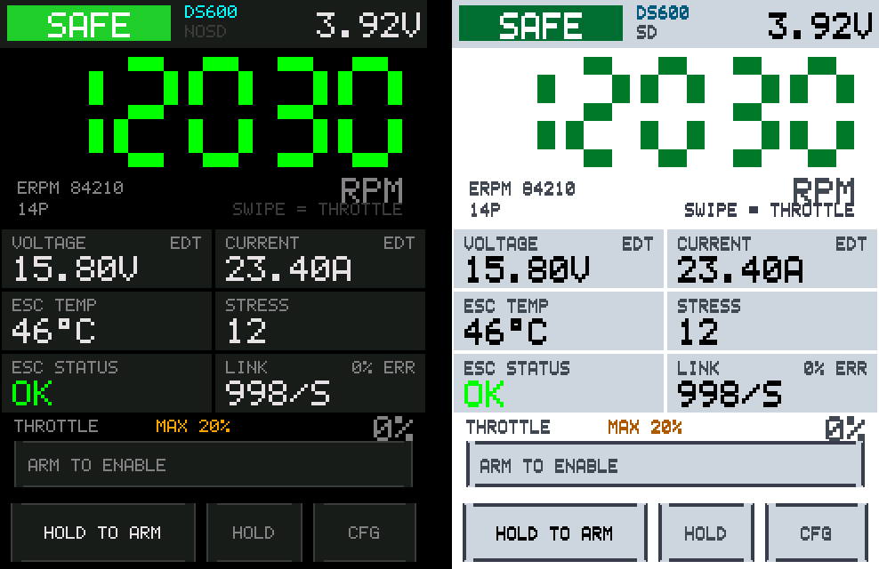
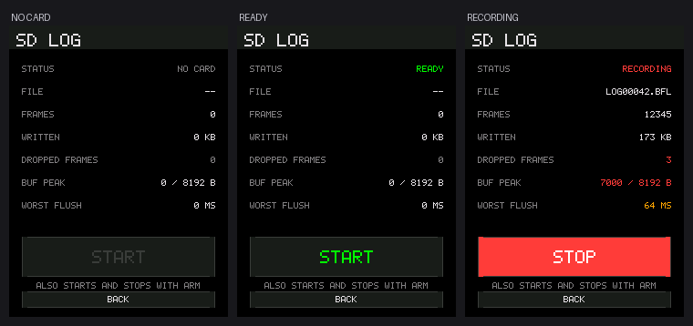
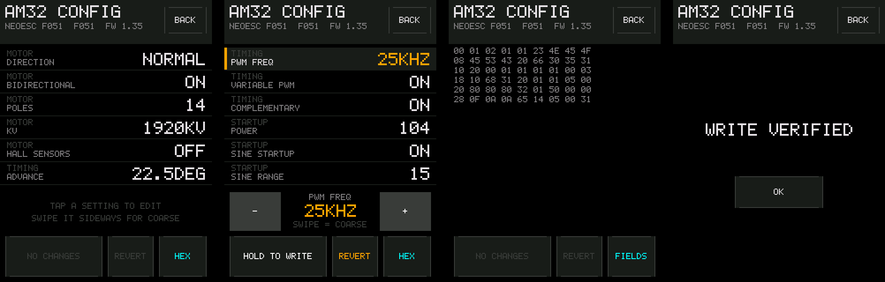

# DshotDisplay

[](https://github.com/subtilitas/DshotDisplay/actions/workflows/ci.yml)

A self-contained bidirectional DShot ESC tester for the **Waveshare RP2350-Touch-LCD-2** and **RP2350-Touch-LCD-2.8**.

Drag the on-screen throttle, and the board sends bidirectional DShot to a single ESC
while decoding the eRPM and Extended DShot Telemetry (EDT) that comes back on the same
wire — RPM, voltage, current, ESC temperature, stress and status — all rendered on the
touch panel. No flight controller, no laptop, no Betaflight.



*Every screenshot here is rendered by the host test suite from the real UI code and
stitched together by `tools/make_previews.py`, so they cannot drift away from what the
board shows.*

---

## Why it's built this way

Bidirectional DShot is half-duplex: the ESC only answers a frame that *you* sent, and it
disarms if frames stop arriving. That means a telemetry display can't be a passive
sniffer — it has to be the throttle source. So this is a bench tester, not a tap.

Frame timing is the whole game. The display does multi-millisecond SPI DMA bursts, which
would wreck DShot timing if they shared a core. So:

| | core0 | core1 |
|---|---|---|
| Job | touch, rendering, battery sense | DShot frame pump + telemetry decode |
| Rate | ~40 Hz | 1 kHz (`DSHOT_PERIOD_US`) |
| Allowed to block | yes, freely | never |

The two cores share one small `critical_section`-guarded struct. Core0 must call
`escHeartbeat()` every frame; if it stops for `UI_HEARTBEAT_TIMEOUT_MS`, core1 assumes the
UI has hung and forces throttle to zero on its own.

---

## Hardware

**Boards:** [RP2350-Touch-LCD-2](https://www.waveshare.com/wiki/RP2350-Touch-LCD-2) (2.0") and
[RP2350-Touch-LCD-2.8](https://www.waveshare.com/wiki/RP2350-Touch-LCD-2.8). Both are
240x320 portrait. They share almost nothing else: different SPI instance for the
panel, different I2C, a different touch controller (CST816D vs CST328), and a
different SD interface — hardware SPI on the 2.0", PIO SDIO on the 2.8".

**One image runs on both.** Build with `-DBOARD=BOARD_UNIFIED` — or take the
`unified` release asset — and the board is a setting rather than a build option:
the first boot finds out which board it is on by probing for the board's
always-on I2C devices (the IMU and, on the 2.8", the RTC — open-drain, and
harmless on the wrong board; see `board_probe.h`), runs on the answer, and
shows it under **CFG → SETUP** for you to confirm with a save. If the probe
cannot tell — nothing answered, or something answered on both buses — the image
stops safely rather than guessing: power latch held, no display, no DShot
output, recoverable over USB. The stored choice can be changed later from the
same screen; saving a *different* board reboots into it, because the display,
the touch controller and the pin map are all built from that choice at boot.
All of this costs about 3 kB of flash against the 4 MB available, and it
removes the failure this project could not otherwise design away — the two
single-board images are indistinguishable once flashed, and the 2.8" one
asserts a power latch the 2.0" does not.

The single-board builds remain (`-DBOARD=BOARD_RP2350_TOUCH_LCD_2` and
`..._2_8`), are slightly smaller, and are still built by CI. They are also what
keeps the preprocessor path from rotting.

The 2.0" is an RP2350A with 16 MB flash, a 240×320 IPS panel (ST7789T3 over
SPI), CST816D capacitive touch, a QMI8658 IMU and a LiPo charger. The 2.8" is
the same silicon behind a larger panel, with a CST328 controller.

### Pin map (2.0", from the official schematic)

| Function | GPIO | Notes |
|---|---|---|
| LCD DC / CS / SCK / MOSI / RST | 16 / 17 / 18 / 19 / 20 | SPI0 |
| LCD backlight | 15 | NPN low-side, PWM at 20 kHz |
| Touch + IMU I2C SDA / SCL | 12 / 13 | I2C0, **shared bus** (touch 0x15, IMU 0x6B) |
| Touch INT | 29 | active low |
| Touch RESET | 20 | **same net as LCD_RST** — resetting one resets both |
| Battery sense | 28 | ADC2, 200k/100k divider → `VBAT = Vadc × 3` |
| microSD | 24–27 | SPI1 — blackbox logging, see below. (2.8": SDIO on 19–24) |
| KISS telemetry RX | 5 | UART1 RX, P1 pin 10 — optional third wire |
| Camera bus | 0–11, 21–23 | **free if no camera is fitted** |

### Wiring the ESC

Two wires. That's it.

| ESC | Board |
|---|---|
| Signal | **GP4** — P2 header, pin 11 |
| Ground | **GND** — P2 header, pin 13 |

Change it from **CFG → SETUP** on the board itself, and it is remembered across
power cycles. `DSHOT_PIN` in `config.h` is only what a board with blank flash
starts on. Any camera-bus pin (GP0–GP11, GP21–GP23) is free, and the picker
offers those and nothing else.

Header pinout for reference:

```
P1: 1=GP7  2=GP9  3=GP8  4=GP22 5=GP21 6=GP18* 7=GP23
    8=GP11 9=GP6  10=GP5 11=GP20* 12=GP19* 13=GND 14=5V
P2: 1=3V3  2=GND  3=GP28* 4=GP29* 5=GP13* 6=GP12*
    7=GP2  8=GP1  9=GP3  10=GP0 11=GP4  12=GP10 13=GND 14=VBAT
                                        (* = used by an on-board peripheral)
```

### Plugging an ESC in directly

Solder a 3-pin male header onto **P2 pins 11–13** and a standard servo plug drops straight
on: signal on GP4, middle position on GP10, ground on pin 13.

> **Cut or depin the middle wire first.** The middle conductor of an ESC lead is the BEC
> **+5 V** output, and RP2350 GPIO is **not** 5 V tolerant — anything above ~3.6 V on a pin
> is over absolute-maximum and damages it. The tester only needs signal and ground.

Three positions on these headers put a GPIO two pins from a ground. GP4 is the one to use:

| Candidate | Header run | Why |
|---|---|---|
| **GP4** ✅ | P2 11–13: GP4 / GP10 / GND | Both the signal pin and the skipped middle pin are unused camera-bus pins. Nothing on-board is involved. |
| GP20 ❌ | P1 11–13: GP20 / GP19 / GND | GP20 *is* LCD_RST — DShot on it would hold the panel in reset. The middle position is GP19, the LCD's live SPI MOSI line. |
| GP29 ❌ | P2 4–2: GP29 / GP28 / GND | GP29 is the CST816D's INT **output**. The touch chip would drive the line low on every touch and fight the ESC. The middle position is the battery-ADC divider node. |

There is no run of `[GPIO][5V][GND]` anywhere on either header, so a fully-populated servo
plug can't work regardless of pin choice — 5 V and GND sit adjacent at P1 pins 14 and 13.
Removing the BEC wire is the answer, not a different pin.

**Power the ESC from its own battery.** Do not try to run a motor off the board's 5 V pin.
Keep the ESC ground and the board ground tied together, and keep the signal wire short —
bidirectional DShot at 600 kBaud does not enjoy 30 cm of unshielded flapping servo lead.
If telemetry is flaky, drop `DSHOT_SPEED_KBAUD` to 300 before blaming the firmware.

### The 2.8" board

Its pin map is `src/board_rp2350_touch_lcd_2_8.h`. The short version: no 2.54 mm
headers at all — everything comes out on JST-SH connectors — and of those, only
**GP28** (J4 pin 11) and **GP29** (J4 pin 12) are free for an ESC. **GP29 is the
default** — last pin on the connector, easiest to find and to solder. Build with
`-DDSHOT_PIN=28` for the other one. An ESC on the wrong one of the two is simply
silent, with nothing reported anywhere, because nothing is listening on the pin
you wired.

It also carries a power-button latch on GP26 that the firmware asserts as the
very first thing at boot. Without it the board drops dead mid-boot whenever it
is running on battery rather than USB.

---

## Building

Native [Pico SDK](https://github.com/raspberrypi/pico-sdk) with CMake. No Arduino
core, no IDE.

You need `cmake`, `ninja` and an `arm-none-eabi` toolchain:

```sh
sudo apt install cmake ninja-build gcc-arm-none-eabi   # Debian/Ubuntu
brew install cmake ninja arm-none-eabi-gcc             # macOS
```

Then fetch the SDK once and point `PICO_SDK_PATH` at it:

```sh
git clone --depth 1 --branch 2.1.1 https://github.com/raspberrypi/pico-sdk.git ~/pico-sdk
git -C ~/pico-sdk submodule update --init --depth 1 lib/tinyusb
export PICO_SDK_PATH=~/pico-sdk
```

`lib/tinyusb` is not optional: serial telemetry goes over USB CDC, and without the
submodule the SDK quietly builds with no USB support at all.

Build:

```sh
cmake -B build -G Ninja -DPICO_BOARD=pico2 -DPICO_PLATFORM=rp2350-arm-s .
ninja -C build
```

Build options worth knowing:

```sh
-DBOARD=BOARD_UNIFIED                # one image for both boards
-DBOARD=BOARD_RP2350_TOUCH_LCD_2_8   # the 2.8" board only; default is the 2.0"
-DDSHOT_PIN=28                       # the ESC pin a blank board starts on
-DSTRICT=ON                          # warnings fatal, for this project's sources
```

`DSHOT_PIN` defaults to **GP4** on the 2.0" and **GP29** on the 2.8". The 2.8"
brings out only GP28 (J4 pin 11) and GP29 (J4 pin 12), so those are the two
choices there — and an ESC on the wrong one is simply silent, with no error
anywhere, because nothing is listening on the pin you wired.

That produces `build/DshotDisplay-touch-lcd-2.uf2`, or `-touch-lcd-2.8.uf2` for
the other board — the board is in the filename because both builds used to
produce the same one, and the two are not interchangeable. Hold **BOOT**, tap
**RESET**, release **BOOT**, and copy it onto the drive that appears.

Add `-DSTRICT=ON` to make warnings fatal for this project's own sources. CI
does; it is off by default so that a toolchain bump turning on a new warning is
something you read rather than something that breaks the build.

Only the Cortex-M33 build is supported. The RP2350's Hazard3 RISC-V cores would work —
the DShot library supports both — but nothing here is built or tested for them.

### Or just flash a release

Prebuilt `.uf2` images are attached to every
[release](https://github.com/subtilitas/DshotDisplay/releases). Hold BOOT, tap RESET,
release BOOT, and copy the file onto the drive that appears.

Every green CI run also uploads a `.uf2` artifact per board, so an untagged change can be
tried on hardware without cutting a release.

`tools/sdtest` is not among them. It is a bench diagnostic, not firmware, and an
unlabelled second `.uf2` beside the real one is an invitation to flash the wrong thing.
Build it locally when a card will not mount — a plain `ninja -C build` produces both.

### Reproducible builds

Dependency versions are pinned in `CMakeLists.txt` and fetched at configure time, so the
tree stays free of third-party source and a build here matches a build anywhere. That
pinning is the point: an unpinned `FetchContent` is a lock file that silently rewrites
itself.

Currently pinned: pico-sdk **2.1.1**, Pico_Bidir_DShot **1.0.2**,
no-OS-FatFS-SD-SDIO-SPI-RPi-Pico **v3.6.2** — by commit SHA rather than by tag,
with the tag in a comment beside each. A tag is a movable reference, and a
pinned-by-tag dependency is the same silently-rewriting lock file as an unpinned
one, just slower about it.

Two notes on those dependencies, both of which cost an afternoon to work out:

- The FatFs driver keeps its `CMakeLists.txt` one directory below the repo root,
  so it needs `SOURCE_SUBDIR`. Without it `FetchContent` downloads the source, defines no targets,
  and the failure surfaces much later as a missing header.
- The SD driver is the **SDIO-SPI** repo, not the older SPI-only one. That one's
  `rtc.c` includes `hardware/rtc.h` — a peripheral the RP2040 has and the RP2350 does
  not, having replaced it with powman. It compiles cleanly for RP2040 and fails
  outright here.

---

## Using it

**Main screen**

- **HOLD TO ARM** — press and hold for 1 s. Refuses to arm unless the throttle has been at
  zero for 250 ms. Once armed the button becomes **DISARM** and responds instantly to a tap.
- **Throttle bar** — behaves differently depending on HOLD, because a latched throttle and
  a momentary one want opposite gestures:

  | | HOLD off (default) | HOLD on |
  |---|---|---|
  | Bar label | `THROTTLE` | `THROTTLE REL` + grab handle |
  | Gesture | **absolute** — finger position *is* the throttle | **relative** — throttle moves by how far the finger travelled |
  | Touching the bar | jumps to that position | changes nothing |
  | On release | springs back to zero | stays where you left it |

  Relative dragging accumulates, so you can build throttle up over several short swipes
  instead of needing one precise placement, and it re-anchors at both rails — overshoot
  the bottom and a small push right responds immediately rather than having to unwind.
  Tune the feel with `HOLD_DRAG_SENSITIVITY_PCT` in `config.h`; below 100 gives finer
  control per swipe.

  The percentage shown is always of the real 0–2000 DShot range, so the number never
  flatters you, while the bar's full width is your configured ceiling.
- **Throttle pad** — the whole number-display area above the gauge (RPM readout and
  telemetry tiles) is a large relative throttle surface. Swipe **up** for more, **down**
  for less. It's a much bigger target than the 26 px gauge strip, so you can adjust
  throttle without looking at the screen, and swipes accumulate.

  It is *always* relative, in both modes, because a big blank region has no positional
  meaning — a tap on it must never move the motor. A 6 px deadzone
  (`PAD_DEADZONE_PX`) means taps, thumb roll and panel jitter are inert; only a deliberate
  drag engages. Sensitivity is `PAD_DRAG_SENSITIVITY_PCT`, default 60, so one full-height
  swipe covers 60 % of the ceiling.

  The pad and the gauge's grab area abut exactly, so there's no overlap and no dead strip
  between them. `SWIPE = THROTTLE` under the RPM readout lights cyan when the pad is live.
- **HOLD** — off is the safe mode. Turn it on only when you actually need a steady-state
  run; turning it off zeroes the throttle immediately.
- **CFG** — settings, and the way to **SETUP**. Entering it force-disarms.

**How the buttons behave**

Every button except DISARM fires when you *lift* your finger, not when you land
it, and shows a pressed outline in between. So a mis-tap can be cancelled by
sliding off before letting go — which is what every touchscreen does, and
therefore the one interaction nobody has to be told about.

DISARM is the deliberate exception. It fires on touch-down, because the control
whose job is "stop the motor now" is the one control that must not wait.

The `-` / `+` steppers repeat while held and accelerate, so the throttle ceiling
is one press end to end rather than twenty taps. A single tap still moves
exactly one step.

Arming and disarming dip the backlight for a moment. It is a whole-panel event,
which means you catch it while looking at the motor rather than at the screen —
and the badge changing colour in a corner is not.

**Settings screen**



*EDT live, EDT silent, and BEEP acknowledging a press.*

- **Motor poles** — eRPM → RPM conversion is `RPM = eRPM / (poles / 2)`. Almost every
  quad motor is 14.
- **Throttle ceiling** — defaults to a deliberately timid 20 %. Raise it when you know
  what's spinning.
- **EDT ON / EDT OFF** — the chip in the title bar. Green while EDT frames are arriving,
  red while they are not. Read-only: there is no enable button, because the firmware
  sends one to each ESC as it appears. It follows *received frames* rather than whether
  the command was sent — the enable is fire-and-forget and the ESC never acknowledges
  it, so arriving telemetry is the only evidence it took.
- **BEEP** — `DSHOT_CMD_BEACON1`, handy for finding which ESC you're actually plugged into.
- **AM32 CFG** — the ESC settings editor. See [AM32 ESC configuration](#am32-esc-configuration).
- **SD LOG** — blackbox logging status and manual start/stop. See below.
- **SETUP** — which pins the ESC and telemetry wire are on, the DShot bitrate,
  high contrast, backlight, and the one button that writes all of it to flash.
  See below.
- **UNSAVED** in the title bar means something on this screen or SETUP differs
  from what is stored. The button that stores it is on SETUP.

BEEP flashes for a moment when pressed. The command itself lasts about six milliseconds
against a 40 Hz repaint, so without that the button looks like it does nothing — and an
ESC answering from the next room is not feedback.

**SD LOG screen**

- **STATUS** — `NO CARD`, `READY`, `RECORDING` or `CARD ERROR`. No card is not a fault;
  the board has no card-detect pin, so the only way to know is to try to mount one.
- **START / STOP** — begins or ends a log immediately. Greyed out with no card.
- **FILE**, **FRAMES**, **WRITTEN** — what is being recorded and how much of it.
- **DROPPED FRAMES** — frames the ring buffer refused because the card could not keep
  up. Anything but zero means the buffer is too small for your card.
- **BUF PEAK** — high-water mark against the configured buffer size. Amber past half,
  red past three quarters.
- **WORST FLUSH** — the longest single write to the card, in milliseconds. This is the
  stall the buffer has to absorb.

**SETUP screen**



*SETUP, the same screen in high contrast, and the UNSAVED marker it puts on the
settings screen.*

| Row | What it does |
|---|---|
| **BOARD** | Which board this firmware is driving. Read-only on a single-board image. On the unified image it cycles the *choice*; nothing is re-wired until you save, and a save that changes the board reboots into it — the display, touch controller and pin map are all built from this at boot |
| **ESC PIN** | Which GPIO carries the DShot signal. Steps through the GPIOs this board leaves free and nothing else, so there is no wrong pin to pick — only pins you have not wired to yet |
| **DSHOT KBAUD** | 150 / 300 / 600 / 1200. Applies immediately: the driver is torn down and rebuilt on the new pin and rate before the next frame |
| **KISS TELEM** | Whether to claim a UART for the telemetry wire |
| **KISS PIN** | Steps only through free GPIOs that can actually *receive*. On RP2350 that is GP1, GP5, GP9, GP13, GP17, GP21, GP25 and GP29, and no others |
| **CONTRAST** | `NORMAL` or `HIGH`. See below |
| **BACKLIGHT** | 0–255. High contrast overrides it to full while it is on |
| **LINK** | Live. Packets per second and the checksum error rate, on the same screen as the pin selector |

`LINK` being here is the point of the screen. Getting the ESC pin wrong is
otherwise completely silent — nothing errors, nothing warns, the ESC just never
hears a frame — so the fix is to put the evidence next to the control. Change
the pin, watch the rate come off zero.

**HOLD TO SAVE** writes everything to flash: both rows above, plus the pole
count and throttle ceiling from the settings screen. It needs a full second,
same as the AM32 write, and for a reason beyond caution — erasing flash parks
core1 for tens of milliseconds, which stops the DShot pump. It is refused while
armed. **RESET** puts the compiled defaults back into the live settings and
touches flash only when you then save.

Everything applies the moment you change it; only persistence waits for the
hold. So a value can be tried and walked away from. The one exception is the
board choice, which cannot be tried live — the hardware is whatever it is — and
therefore applies by rebooting after the save.

**High contrast**



*The tester screen indoors and in the sunlight palette.*

Black on white, every accent darkened until it will carry white text, one pixel
of extra weight on every glyph stroke, two-pixel frames, a fatter
seven-segment stroke, and the backlight forced to full. A dark palette is the
right choice on a bench and close to unreadable on a transmissive IPS panel in
direct sun.

The greys collapse on purpose. Three distinguishable greys is an indoor luxury;
outdoors a mid-grey label is simply gone, so the label tier gives up its
distinctness and keeps its legibility.

The extra glyph weight is a one-pixel vertical smear, never horizontal: the 5x7
font sits in a 6 px cell, so thickening sideways would close the gap between
glyphs and run words together. Downward costs no advance width, so not one
label moves and every layout assert still holds.

**Reading the telemetry**

`--` means neither source has ever supplied that field. Plain eRPM always works on
bidirectional DShot; voltage, current, temperature, stress and status need EDT support in
the ESC firmware (BLHeli_32, Bluejay, AM32). The **LINK** tile shows good packets per
second and the checksum error rate — at 1 kHz you should see close to 1000/s and 0 % err.
A rising error rate points at signal integrity, not at the ESC.

The voltage and current tiles carry a small **KISS** (cyan) or **EDT** (dimmed)
tag saying where the number came from. It matters: `12.25 V` from EDT means
"somewhere in a 0.25 V bucket", the same reading from KISS means "within 0.01 V". If the
tag drops from KISS back to EDT the telemetry wire has gone quiet, and the readout is
suddenly 25x coarser without the digits obviously changing. Consumption in mAh appears on
the temperature tile and is KISS-only — EDT does not carry it.

---

## Telemetry and logging

EDT is enabled automatically — you should not normally need that button. The enable
goes out once per ESC, triggered by the first eRPM frame rather than by a timer: an ESC
that has answered a frame is demonstrably powered, booted and listening. Lose eRPM for
`ESC_LINK_STALE_MS` and the one-shot re-arms, so an ESC connected later, power-cycled,
or swapped for a different one gets its own enable instead of silently running without
EDT for the rest of the session.

Every reading expires. A value that has not been refreshed for `EDT_STALE_MS` (1 s)
blanks to `--` rather than holding its last number, and eRPM does the same after 500 ms.
This matters more than it sounds: unplug the ESC, or swap it for a different one, and a
display that keeps the old figures is not showing stale data — it is showing a plausible
reading from hardware that is not there. `RPM` drops to a dark zero and the header says
`NO TELEMETRY`.

The one exception is a deliberate one: an expired **ESC STATUS** reads `--`, never `OK`.
A warning indicator may fail towards "unknown" but must never fail towards "fine".

### KISS telemetry (optional third wire)

Extended DShot Telemetry rides inside the eRPM frame and costs no extra wiring,
but it is coarse: voltage in 0.25 V steps, current in whole amps. On a 6S pack
that means a 200 mV sag is invisible and idle current is unmeasurable.

A KISS-compatible ESC — most BLHeli_32 and AM32 firmware — will send **0.01 V
and 0.01 A** over a dedicated wire when the DShot frame asks for it, plus a mAh
consumption figure EDT has no room for at all.

| ESC | Board |
|---|---|
| Telemetry pad | **GP5** — P1 header, pin 10 |

That is the only extra connection; the line is transmit-only from the ESC.
Requests go out at 50 Hz by default (`KISS_REQUEST_EVERY_N`).

The voltage and current tiles show which source they are using —
**KISS** in cyan, **EDT** dimmed. That tag is not decoration: 12.25 V from EDT
means "somewhere in a 0.25 V bucket" and the same reading from KISS means
"within 0.01 V", so a readout quietly dropping back to coarse values is worth
seeing. Unplug the wire and the tiles fall back within `KISS_STALE_MS`.

> **Voltage.** The KISS spec puts this line at 3.6 V, which is exactly the
> RP2350's absolute-maximum GPIO voltage — no margin at all. Most ESCs actually
> drive 3.3 V and are fine, but measure yours before connecting it, and consider
> a 1 k series resistor.

RPM is deliberately **not** taken from KISS. Not because it is coarser — above
about 5,000 RPM on a 12–16 pole motor it is actually finer, since bidirectional
DShot encodes a period with a 9-bit mantissa and degrades in absolute terms as
RPM rises — but because it arrives at 50 Hz against DShot's 1 kHz, and spin-up,
oscillation and desync all live in the fast stream. Both are written to the log
so the question can be settled with data. The arithmetic is in
`docs/design/erpm_resolution.py`.

### Blackbox logging to microSD

Logs are written in Betaflight's blackbox format, so they open directly in
[**logwiju**](https://subtilitas.github.io/logwiju/) — the intended viewer for
these logs — as well as Blackbox Explorer, `blackbox_decode` and PIDtoolbox.
Files are named `LOGnnnnn.BFL` on a FAT-formatted card.



Works on both boards, by different means: the 2.0" drives the card over hardware
SPI at 12 MHz, the 2.8" over four-bit PIO SDIO at 10 MHz. That is not a
preference — the 2.8" cannot use hardware SPI at all, since its SD clock lands
on a pin that is SPI0 *TX* in the mux.

Reach it from **CFG → SD LOG**. The screen shows card state, the current file,
frames and kB written, dropped frames, buffer high-water mark and the worst
single card write. Logging starts and stops with **ARM** by default
(`SD_LOG_AUTO_ON_ARM`), and the START/STOP button is always available.

At the default 500 Hz the log runs about **14.5 bytes per frame — 7.3 kB/s, or
26 MB/hour**, which no card will struggle with.

The two numbers worth watching on first use are **BUF PEAK** and **WORST
FLUSH**. `SD_LOG_BUFFER_BYTES` defaults to 8 kB, which is roughly a second of
data, but the right size depends on how long your card stalls for an internal
erase — and that is a property of the card, not something to guess. A peak
approaching the buffer size, or a flush longer than the buffer holds, means
raise it. **DROPPED FRAMES** above zero means it was already too small.

Frames are dropped rather than blocking, always. A gap in the log is
recoverable; a stalled UI with a live motor is not.

### Tuning

All in `config.h`. The defaults are chosen to be safe rather than optimal, since
none of this has been measured against real hardware yet.

Six of these are only *defaults* now — the ESC pin, the DShot bitrate, the KISS
wire, the pole count, the throttle ceiling and the backlight are all changeable
on the board from **CFG → SETUP** and stored in flash. Editing them here and
reflashing will look like it did nothing on a board that has saved settings,
because the stored value wins. The SETUP screen says which one you are looking
at.

| Setting | Default | What it does |
|---|---|---|
| `KISS_TELEM_ENABLE` | `1` | Compile the KISS path in at all |
| `DEFAULT_KISS_ENABLE` | `1` / `0` | Whether the KISS wire is expected. **Off on the 2.8"**: its only free UART RX pin is GP29, which is also where the ESC signal goes by default |
| `DEFAULT_KISS_PIN` | `5` / `29` | GPIO the telemetry wire lands on, receive only. Runtime-adjustable |
| `KISS_REQUEST_EVERY_N` | `20` | Request every Nth DShot frame; 20 at 1 kHz is 50 Hz. Must be ≥ 2 or replies overlap, and there is an `#error` that says so |
| `KISS_STALE_MS` | `500` | How long a KISS frame stays authoritative before the display falls back to EDT |
| `EDT_STALE_MS` | `1000` | How long an EDT field stays valid after its last frame. Past this the tile blanks to `--` rather than holding a reading from an ESC that may no longer be attached |
| `ESC_LINK_STALE_MS` | `500` | How long without eRPM before the ESC counts as gone. Re-arms the automatic EDT enable, so a replacement gets its own |
| `KISS_REPLY_TIMEOUT_MS` | `10` | Abandon a reply that has not completed; only affects the timeout counter |
| `SD_LOG_ENABLE` | `1` | Compile the logging path in at all |
| `SD_LOG_SPI_MHZ` | `12` | Card clock on the 2.0". Cards are specified to 25 MHz; a card misbehaving at speed fails in ways that look like corruption |
| `SD_LOG_SDIO_HZ` | `10 MHz` | Card clock on the 2.8", where `SD_LOG_SPI_MHZ` is ignored. Deliberately below what the card managed in `sdtest` — SDIO is far more sensitive to signal integrity, and a card that enumerates but corrupts is worse than one that refuses |
| `SD_LOG_RATE_HZ` | `500` | Log frame rate. Not the DShot rate — eRPM is the only genuinely 1 kHz signal |
| `SD_LOG_I_INTERVAL` | `32` | Frames between keyframes. Lower resynchronises faster after damage, at a size cost |
| `SD_LOG_BUFFER_BYTES` | `8192` | Ring buffer. **The one to measure** — see BUF PEAK and WORST FLUSH |
| `SD_LOG_CHUNK_BYTES` | `512` | Flush granularity. Keep it a multiple of 512 or the card does read-modify-write |
| `SD_LOG_PREALLOC_BYTES` | `16 MB` | Contiguous space reserved per file, so the FAT is not rewritten mid-log. About ten minutes at the default rate |
| `SD_LOG_SYNC_MS` | `2000` | How often the file's directory entry is committed. Without it the only sync is at STOP, so pulling the battery mid-run loses the whole file rather than the last two seconds |
| `SD_LOG_AUTO_ON_ARM` | `1` | Start and stop logging with ARM, alongside the manual button |

### Reading the logs

Files land on the card as `LOGnnnnn.BFL`.

<div align="center">

[](https://subtilitas.github.io/logwiju/)

### **[logwiju](https://subtilitas.github.io/logwiju/)** — the intended viewer for these logs

</div>

Drag a `.BFL` straight off the card onto the page and it plots it — no install, no
upload, no account. It runs entirely in the browser, so the log never leaves your
machine. Wheel to zoom, drag to pan, shift+drag for a box zoom, double-click to fit;
pick which fields to show from the side panel.

Say it in German — *log-vee-yoo*, since German `w` is an English *v* and `j` an English
*y* — and it comes out as "logview". The tail is **WI**ngert **JU**lian.

The logs also open in
[Blackbox Explorer](https://github.com/betaflight/blackbox-log-viewer), or on the
command line:

```sh
blackbox_decode LOG00001.BFL      # -> LOG00001.01.csv and .01.event
```

The `.event` file holds the end-of-log marker and is usually empty otherwise; the CSV is
what you want.

Both eRPM sources are logged separately, as `eRPM[0]` (bidirectional DShot, 1 kHz) and
`eRPMkiss[0]` (KISS, 50 Hz), and so are both voltage and current sources — `vbatLatest` /
`amperageLatest` carry KISS where it was live, `vbatEdt` / `amperageEdt` always carry EDT.
That redundancy is deliberate: it lets the KISS decoder be checked against a source
already trusted, from the log itself, rather than taken on faith.

## AM32 ESC configuration

**CFG → AM32 ESC CONFIG** reads and edits an AM32 ESC's settings over the same signal wire,
with no laptop involved. Settings only for now; the transport is deliberately general so
firmware flashing drops in later.



Entering config mode disarms, tears down the DShot driver and hands the signal pin to the
bootloader transport. Leaving hands it back.

### Connecting

Power the ESC, then open config mode. Each attempt **holds the signal line low** for
`AM32_BOOT_LOW_MS` (default 200 ms), which makes AM32's running firmware give up on finding
a valid input and jump to its bootloader. That's what allows connecting to an ESC that is
already powered, instead of having to catch the brief listening window right after power-up.
The line is then released, and the greeting is sent.

If it doesn't connect, the screen tells you *which* half failed:

| Message | Meaning | What to change |
|---|---|---|
| `NO REPLY - ESC DID NOT JUMP` | Line stayed silent | Raise `AM32_BOOT_LOW_MS`; try `AM32_PUSH_PULL_TX 0` |
| `GOT n BYTES: xx xx xx` | ESC is talking, reply didn't parse | Baud or framing, not the jump — the bytes are shown so you can see what arrived |

That distinction matters: silence and garbage need completely different fixes, and without
a scope on the signal wire there's otherwise no way to tell them apart.

Set `AM32_DEBUG 1` in `config.h` to mirror every transport step to USB serial.

### Editing

Two gestures, coarse and fine:

| Gesture | Effect |
|---|---|
| Tap a row | Selects it; the editor bar at the bottom shows its name and value |
| **Swipe the row sideways** | **Coarse** — one full-width swipe covers the field's entire range |
| `-` / `+` buttons | **Fine** — one step per press; hold to repeat, accelerating |
| Drag up/down | Scrolls the list |

Axes are locked exclusively after 10 px of travel, so a swipe is either a scroll or an edit
and never both. Coarse swipes snap to each field's own step, so motor poles stay even, and
they re-anchor at the ends — overshoot the top and a small swipe back responds immediately
instead of unwinding.

Changed rows are marked amber down the left edge. **REVERT** restores everything to what
was read. **HEX** shows the raw 48 bytes, which is the escape hatch if a field is ever
decoded wrongly.

Writing needs a **one second hold** on `HOLD TO WRITE` — a stray tap must never reprogram a
motor controller. After writing, the block is read back and compared; a write that reports
success but lands wrong is worse than one that fails loudly, so the screen only says
`WRITE VERIFIED` if the readback matches byte for byte.

### Protocol

| | |
|---|---|
| Link | one-wire half-duplex serial, 19200 8N1, on `DSHOT_PIN` |
| Init string | 21 bytes: twelve `0x00`, `0x0D`, `"BLHeli"`, `0xF4 0x7D` |
| Commands | `SET_ADDRESS 0xFF 00 hi lo`, `SET_BUFFER 0xFE 00 00 len`, `PROG_FLASH 0x01 0x01`, `READ_FLASH 0x03 len`, `ERASE 0x02`, `RUN 0x00` |
| Checksum | CRC-16/ARC — polynomial `0xA001`, init 0, appended low byte first |
| ACK | `0x30`, always the last byte received |
| Settings | 48 bytes, at an address that depends on the MCU |

The settings page is **not** at a fixed address. The handshake reply identifies the MCU
family in its fifth-from-last byte, and that decides where to look:

| Type byte | Family | Settings at |
|---|---|---|
| `0x2B` | STM32G071, 2 KB pages | `0x7E00` |
| `0x1F` | STM32F051, 1 KB pages | `0x7C00` |
| `0x35` | STM32F3, 2 KB pages | `0xF800` |

Indexing the reply from the *end* rather than the start is deliberate: a host with a
hardware UART on the shared wire also captures its own transmission, so only the tail is
in a predictable place.

Bytes `0x05..0x0C` are overloaded — device name before layout revision 3, ramp and
current-PID settings from revision 3 on — so fields are version-gated and the wrong set is
never shown.

Because host and ESC share one conductor, everything transmitted is echoed back and
discarded before the reply is read. Interrupts are masked per byte rather than per frame:
masking for a whole frame would starve the system for milliseconds, while per byte keeps
the critical section near half a millisecond.

### Verification

Two independent cross-checks, both run from the host test harness:

- Every protocol constant is asserted against a known-working Python configurator —
  init string, all six command encodings, CRC polynomial and byte order, ACK position, and
  all three MCU-to-address mappings.
- The field table is decoded against that tool's own default settings blob and compared to
  the semantics documented in its byte comments: 14 poles, 24 kHz, 2200 KV, 15° advance,
  3.0 V cell cutoff, 1502 µs servo neutral, 204 A current limit, and so on.

The current-limit `×2` factor and the one-based protocol enum were both wrong until that
second check caught them.

---

## Safety

A motor on a bench is genuinely dangerous, and a propeller on a bench doubly so.

Built into the firmware:

- Boots disarmed and sends `MOTOR_STOP` continuously.
- Arming needs a deliberate 1 s hold with the throttle already at zero.
- Throttle springs back to zero on finger-lift unless HOLD is explicitly enabled.
- Configurable throttle ceiling, default 20 %.
- Auto-disarm after 30 s with no touch input (`IDLE_DISARM_MS`), counted down
  on screen for the last five seconds. A motor stopping for no visible reason is
  indistinguishable from a fault.
- Core1 zeroes the throttle if core0 stops sending heartbeats.
- Entering the settings screen force-disarms, and so does changing any wiring.
- A settings save is refused while armed: writing flash stops the DShot pump.
- A stored settings block that fails its CRC, version or size check is discarded
  whole and the compiled defaults are used — never merged field by field, so a
  corrupted byte cannot become a raised throttle ceiling.

Not built into the firmware, and up to you:

- Take the prop off unless you specifically need it on.
- Clamp the motor down. Every time.
- Eye protection, and stay out of the plane of rotation.
- Have a way to cut battery power that isn't the touchscreen.

None of that makes the tester safe — it makes it *less unsafe*. The software interlocks are
a backstop for your habits, not a replacement for them.

---

## Layout

```
CMakeLists.txt          build + pinned dependency versions
pico_sdk_import.cmake   locates the SDK via PICO_SDK_PATH
src/
  main.cpp              core0 main(), core1 launch, @page architecture
  plat.h                millis/micros/delay over the SDK timebase
  config.h              defaults for everything you'd want to tune
  settings.{h,cpp}      the persisted subset: rules, validation, fallback (pure)
  settings_flash.cpp    the one flash sector those live in
  theme.{h,cpp}         the two palettes and the stroke weights
  board.h               which board(s) this build can drive
  board_pins.h          dispatches to the per-board pin map (single-board builds)
  board_rp2350_touch_lcd_2{,_8}.h   the pin maps themselves
  board_desc.{h,cpp}    the board as data, so one image can drive either
  board_desc_lcd2{,_8}.cpp  one descriptor each, one board header each
  touch.cpp             dispatches to whichever touch driver the board names
  esc_task.{h,cpp}      core1 DShot pump, EDT decode, cross-core state
  ui.{h,cpp}            screens, touch handling, arm/throttle state machine
  ui_am32.{h,cpp}       AM32 config screen: connect, edit, verified write
  ui_setup.{h,cpp}      SETUP screen: pins, bitrate, contrast, hold-to-save
  ui_input.{h,cpp}      tap-on-release and held-repeat rules, shared (pure)
  am32_bl.{h,cpp}       one-wire bootloader transport (reused for FW flashing)
  am32_eeprom.{h,cpp}   AM32 settings layout, decoding and presentation
  gfx.{h,cpp}           RGB565 framebuffer, dirty bands, 5x7 font, 7-seg digits
  st7789.{h,cpp}        panel init + DMA blitter
  touch.h               capacitive touch interface, one driver compiled
  cst816.cpp            CST816D — the 2.0" board
  cst328.cpp            CST328 — the 2.8" board
  kiss_telem.{h,cpp}    KISS ESC telemetry decode (pure)
  esc_merge.{h,cpp}     per-field preference between KISS and EDT (pure)
  blackbox_encode.{h,cpp} Betaflight blackbox log writer (pure)
  log_ring.{h,cpp}      ring buffer between encoder and card (pure)
  sd_log.{h,cpp}        FatFs writer, lifecycle, drop accounting
  sd_hw_config.c        SD wiring for the FatFs driver
tools/
  sdtest/               standalone SD bring-up test; built locally, never released
  make_previews.py      restitches docs/*.png from the test suite's frames
Doxyfile                API doc config -> docs/html/
docs/                   generated docs + preview images
docs/design/            design notes, kept in step with the code
test/                   host test suites + Pico SDK stubs
.github/workflows/      CI
```

Everything is under `src/`, `main.cpp` included — there is no sketch root to keep an `.ino`
at any more. Files include each other as plain siblings.

The modules marked *pure* have no hardware dependency at all: they are compiled into the
host test binary and exercised directly. That is deliberate, and it is what makes the
protocol and codec work testable without a board on the desk.

### Tests

The firmware's own logic runs on a PC against stubs in `test/stubs/` that mirror the
Pico SDK signatures:

```sh
cd test && make
```

Needs nothing but a C++17 compiler. Time is virtual — `millis()` advances only when a test
says so — which makes hold-to-arm, hold-to-write and gesture repeat deterministic rather
than dependent on machine speed. The fake ESC serves a real settings blob recovered from
the reference configurator, so the UI tests operate on values a real ESC would report.
The suite renders every screen to PPM as it runs — splash, the main screen live, armed
and with the ESC gone, the settings screen in each of its states, all three SD log states
and the four AM32 screens — so a layout change is visible rather than something you find
on the board later. Failing tests dump their frame too.

`make previews` restitches the images in `docs/` from those frames. It is a separate
target so a test run does not leave the working tree dirty, but it is one command,
because the manual version of this step is what let the published screenshots sit several
UI revisions out of date.

`sd_log.cpp` cannot be linked on the host (FatFs and the SPI driver come with it), so the
logging UI is tested against a fake logger in `fakes.cpp`. The fake is the observable:
tapping START has to actually reach `sdLogStart()` for its state to change, which covers
navigation, hit-testing and dispatch without production code carrying test-only
accessors.

`test_ui.cpp` `#include`s `ui_am32.cpp` rather than linking it, so tests can read its
file-static state without production code carrying test-only accessors. That's why the
Makefile does not list `ui_am32.cpp` in `SRCS`.

### Continuous integration

`.github/workflows/ci.yml` runs five jobs:

| Job | What it catches |
|---|---|
| **Firmware** | Real Pico SDK build for both boards, pinned by `CMakeLists.txt`, plus UF2 validation |
| **Host tests** | Protocol, codec and UI regressions a compile cannot see |
| **Blackbox round-trip** | Encodes a log and decodes it with Betaflight's own `blackbox_decode`, comparing every value |
| **Config permutations** | All 64 combinations of board, `AM32_PUSH_PULL_TX`, `AM32_FORCE_LOW_JUMP`, `LCD_ROTATION`, `KISS_TELEM_ENABLE` and `SD_LOG_ENABLE`, warnings fatal |
| **Doxygen** | Undocumented additions |
| **Workflow lint** | `actionlint`, plus a duplicate-key check that PyYAML would otherwise let through and GitHub would not |

The firmware job also asserts the image belongs to the board it claims: which
touch driver was compiled in, read out of the DWARF line table because both
drivers export exactly `touchInit` and `touchPoll` and the symbol table cannot
tell them apart. It checks the size against a ceiling, and that `-DDSHOT_PIN`
is honoured — a documented option CI had never once passed.

The permutation job exists because those options are exactly the ones nobody compiles by
hand. `check_docs.py` enforces documentation precisely — public API documented, `@param`
names matching signatures, no dangling `@ref` — where Doxygen's `WARN_IF_UNDOCUMENTED`
would also demand a comment on every file-static `s_scroll`.

### Releases

```sh
git tag -a v1.0.0 -m "First release"
git push origin v1.0.0
```

`release.yml` runs the host and documentation checks, builds a `.uf2` for each board,
checksums them, and publishes a GitHub Release with the images attached.

Assets per release:

```
DshotDisplay-v1.0.0-unified.uf2        <- runs on either board
DshotDisplay-v1.0.0-touch-lcd-2.uf2
DshotDisplay-v1.0.0-touch-lcd-2.8.uf2
SHA256SUMS.txt
```

Four things it refuses to do, each because the failure is otherwise silent:

- **Build from failing code** — a broken image carrying a version number is worse than no
  release at all.
- **Publish an implausible image** — the `.uf2` is checked for the `UF2\n` magic and a
  512-byte-multiple size, so a truncated or mis-copied file fails the build rather than the
  user's board.
- **Invent a tag** — `--verify-tag` aborts if the tag was never pushed.
- **Leave a half-populated release** — creating a release and attaching assets are separate
  API calls, so the workflow reads the release back and confirms every expected asset is
  actually there.

### API documentation

The source is annotated in Doxygen style, and a `Doxyfile` is checked in:

```sh
doxygen            # writes docs/html/index.html
```

`EXTRACT_ALL` is deliberately `NO`, so anything you add without documentation
shows up as a warning rather than silently producing an empty page:

```sh
doxygen 2>&1 | grep -i warning
```

`EXTRACT_STATIC` is on — most of this firmware is file-static, so leaving it off would
document almost nothing. The `@page architecture` block lives in `src/main.cpp` and covers the
two-core architecture; this README is rendered as the front page.

### Rendering

The whole 240×320 frame lives in SRAM (150 KB of the RP2350's 520 KB).
Draw calls record the vertical span they touched; only those full-width bands get DMA'd,
each as one contiguous transfer with no per-row restart cost. Each UI zone also caches the
values it last displayed and skips drawing entirely when nothing changed, so a steady
screen costs almost no SPI traffic at all.

**Pixel format** — the SPI peripheral switches to 16-bit frames for pixel data, so RGB565
words go out MSB-first with no software byte swapping. Commands go out in 8-bit frames.

---

## Credits

- [pico-bidir-dshot](https://github.com/bastian2001/pico-bidir-dshot) by bastian2001 — the
  PIO DShot implementation doing the actual protocol work.
- [logwiju](https://subtilitas.github.io/logwiju/) — the browser-based blackbox viewer
  these logs are meant to be read in. Said in German it is simply "logview".
- [DShot — the missing handbook](https://brushlesswhoop.com/dshot-and-bidirectional-dshot/)
- [Extended DShot Telemetry](https://github.com/bird-sanctuary/extended-dshot-telemetry)
- [Waveshare RP2350-Touch-LCD-2 wiki](https://www.waveshare.com/wiki/RP2350-Touch-LCD-2)
  and [schematic](https://files.waveshare.com/wiki/RP2350-Touch-LCD-2/RP2350-Touch-LCD-2.pdf)

## License

This repository's own code is MIT (see `LICENSE`).

Note that `pico-bidir-dshot` is **GPL-3.0**. That's fine for personal use, but a compiled
binary of this sketch links GPL-3.0 code, so if you distribute firmware images or a
derived product you'll need to satisfy GPL-3.0 for the combined work. Worth settling
before you ship anything.
